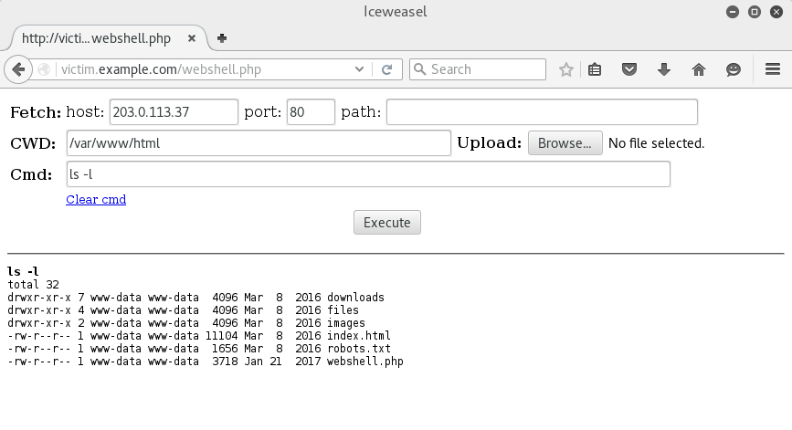

# wwwolf's PHP web shell

I frequently encountered issues when using other web shells:

* They use new PHP syntax features not compatible with the old PHP version
  running on some targets.
* They make wrong assumption on the remote URL, breaking PHP code injection or
  GET parameters (un)expected by the server.
* They often only display standard output content, throwing away stderr.
* They poorly handle special characters in output display (such as `<`).
* They do not allow file upload, or offer a method unsupported/blocked by the
  target's settings.
* They require manual modification depending whether the target is running
  a UNIX-like or a Windows system.

Here is my attempt to solve these issues. As opposed to some other solutions,
this one does not even barely aim to become a *"full-featured 
post-exploitation framework"*. It's only goal is to provide a stable and
reliable way to get a foot in the door on the target by adhering to the KISS
principle as much as possible and staying generic enough to let you build what
you want from there without getting in your way.

*WhiteWinterWolf's PHP web shell*:

- Access can be **password protected**.
- Is compatible with both **UNIX-like and Windows systems with no modification**.
- Attempts to clear PHP output buffer (ie. drop any "garbage" code already
  produced by the attacked application) and enforce PHP code execution
  termination to provide the most **clean and stable behavior**.
- The form is **submitted as a POST requests** keeping the exact same URL (including
  the exact same GET parameters, nothing added or removed) which has been used
  to access it in the first place. **No assumption is made**, making it suitable
  for twisted code injection techniques. Moreover the remote server may not
  log POST data, and thus may not log the actual commands execute on the target.
- **Sensible default values** are applied:
  - The current working directory is set to the actual current working
    directory. This has the added advantage of easily telling you the remote
    system-type (`/var/www/html` vs. `C:\Inetpub\wwwroot`).
  - The fetch source host is set to your IP address as seen from the targeted
    server.
- You can freely **set the working directory** and the value is kept among commands.
  A specific warning message is displayed in case PHP's `open_basedir` setting
  may limit your ability to move throughout the server.
- There is **two different ways to upload files** to your targets:
  - A classical upload form if the remote PHP settings allows it.
  - Fetch the file from a given host and URL (usually a host controlled by the
    attacker). This feature implement a *very* basic HTTP fetch functionality
    allowing to circumvent PHP's `url_allow_fopen` setting limitation. It does
    not handle fancy things like HTTP redirection or authentication, but *may*
    still handle SSL/TLS by prepending the hostname accordingly
    (`tls://203.0.113.37`).
- A link `Clear cmd` allows to **clear and set the focus on the command input
  form field in a single click**. I find it convenient to quickly execute a few
  arbitrary commands on the server but this feature relies on JavaScript. If
  you want to avoid JavaScript you can remove this single-line, this will not
  affect the rest of the web shell which does not use JavaScript anywhere else.

This script applies the form settings in the given order:

1. Current working directory.
2. Files to upload.
3. Command to execute.

This allows to upload a file in a given directory and immediately execute it in
a single HTTP request.

More information can be found on the [main project page][].

This script is provided only for security research and assessment purposes.
Do not use it for anything illegal!

[main project page]: https://www.whitewinterwolf.com/tags/php-webshell/
	"wwwolf's PHP webshell project page"
